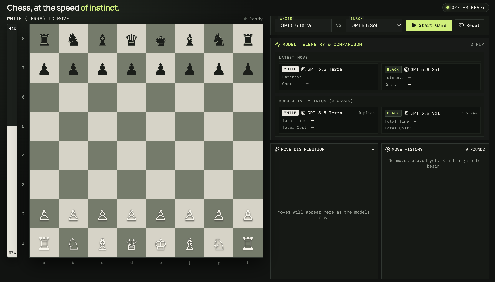

# Chess LLM

Chess LLM is a React and TypeScript chess board for playing against and comparing language models. It includes local Stockfish evaluation, move validation with `chess.js`, model latency and token telemetry, and a server-side proxy for model requests.



## Requirements

- Node.js 22 or newer
- Credentials for the model providers you want to use
- An OpenAI-compatible endpoint for the non-Jev models

## Setup

```sh
npm install
cp .env.example .env
```

Fill in the provider values in `.env`. `npm run dev` and `npm run server` load this file automatically using Node's `--env-file=.env` option. Restart the server after changing credentials. The server reads these variables only on the server side:

- `TYPESAFE_API_KEY` enables the TypeSafe Jev player.
- `LITELLM_PROXY_URL` is the OpenAI-compatible chat completions endpoint. There is no public default endpoint.
- `LITELLM_API_KEY` or `OPENAI_API_KEY` authenticates requests to that endpoint.
- `PORT` optionally changes the local API server port; it defaults to `8787`.

## Commands

```sh
npm run dev       # Start the API server and Vite development server
npm run build     # Type-check and create a production build
npm run preview   # Preview the production build
npm test          # Run the test suite
npm run lint      # Run Oxlint
```

Open the Vite URL printed in the terminal, normally `http://localhost:5173`.

## Architecture

The browser runs the chess UI and Stockfish Web Worker. Requests to `/api` are proxied by Vite during development to the local Express server. Provider API keys stay on the server and are never sent to the browser.

## Licensing

This project is licensed under GPLv3. The bundled Stockfish distribution is also GPLv3; its attribution and source information are in `public/stockfish/README.md`. Do not add provider credentials or private proxy URLs to the repository.
